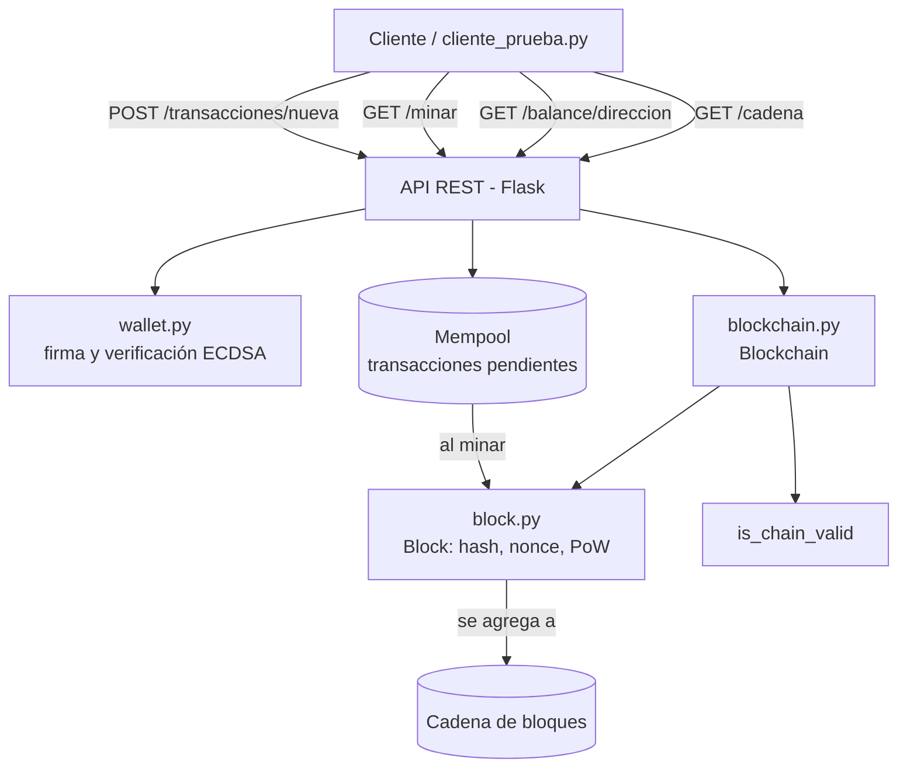

# Diagrama de arquitectura - Criptonico

## Componentes

- **wallet.py**: genera pares de llaves (ECDSA/secp256k1), deriva direcciones,
  firma y verifica transacciones.
- **block.py**: define la estructura de un bloque y el algoritmo de minería
  (Proof of Work).
- **blockchain.py**: mantiene la cadena, el mempool, calcula balances y valida
  la integridad de toda la cadena.
- **nodo.py**: expone todo lo anterior como una API REST con Flask.
- **cliente_prueba.py**: simula un usuario externo que crea una wallet, firma
  una transacción y la envía al nodo.